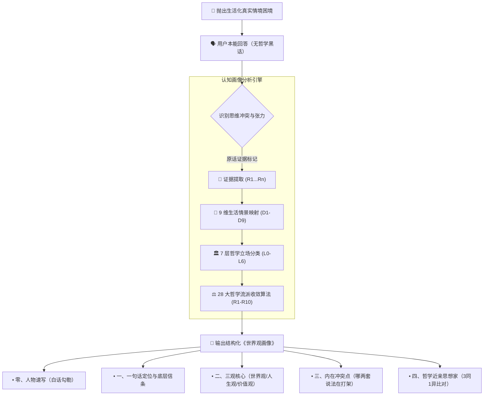

<div align="center">

<!-- [占位] 顶部主视觉横幅：建议 1200x420 雅典学派/理性黑金风格，详见 assets/README.md -->
<!--  -->

# 🧭 Worldview Profiler · 三观画像师

<p align="center">
  <b>消解内在思想混乱的认知向导 • 多轮情境对话导出可追溯的三观思想画像</b><br>
  不灌鸡汤、不贴标签。从真实生活困境出发，映射至中西 28 大哲学流派与历史思想家谱系。
</p>

<p align="center">
  
  
  
  
  
  
</p>

<p align="center">
  <a href="#-为什么需要三观画像"><b>💡 解决什么</b></a> •
  <a href="#-核心代差对比"><b>⚖️ 核心代差</b></a> •
  <a href="#-认知探寻工作流"><b>🔄 探寻流程</b></a> •
  <a href="#-三种参与模式"><b>🎮 三种玩法</b></a> •
  <a href="#-画像长什么样"><b>📜 画像样例</b></a> •
  <a href="#-极速安装"><b>🚀 极速安装</b></a>
</p>

</div>

---

> *"未经审视的人生，不值得过。"* —— 苏格拉底《申辩篇》

短视频每天向你灌输一种主义，原生家庭教一套，职场生存又是一套。  
你哪边都信一点，又哪边都不全信；看似都懂，但一遇到大事决策，脑子里两套观念就开始剧烈打架。  
**三观画像师只做一件事：陪你把这些说法一个个捞出来，看清它们分别是谁，哪套说了算，哪两套还在打架，最后收拢成一张你能核对、能质疑、能修订的结构化画像。**

---

## ⚖️ 核心代差对比 (Why It Matters)

<!-- [占位] 终端对话与画像产出动图演示：详见 assets/README.md -->
<!-- <div align="center"></div> -->

| 维度 | 流行性格测试 (MBTI / 占星) | 泛心理咨询 / 灌鸡汤 | `worldview-profiler` 认知画像 |
| :--- | :--- | :--- | :--- |
| **底层逻辑** | 强行套用 4 字母或标签，将复杂人性格子化 | 情绪抚慰与主观建议，容易形成情绪依赖 | **结构化思想解耦**：厘清核心信念与底层依据 |
| **真实度把控** | 迎合巴纳姆效应，全是好听但模糊的共性话 | 倾向于认同用户情绪，缺少对逻辑自洽的审视 | **反谄媚与反接管**：对“能解释一切”的体系索要反例与边界 |
| **结论证据链** | 黑盒算分，无法知道结论从何而来 | 依赖咨询师个人经验 | **100% 原话溯源**：每条结论带 `[R4]` 原话标记，可当场纠偏 |
| **思想谱系定位** | 缺乏跨时代的思想纵深 | 局限于生活技巧与当下感受 | **对齐中西 28 大哲学流派**：寻找历史近亲与思想同路人 |

---

## 🔄 认知探寻工作流 (Methodology)

系统依托 Schwartz 价值观、Yalom 存在主义四大终极关怀、Frankl 意义治疗及道德基础理论（MFT），全程纯本地离线驱动：



---

## 🎮 三种玩法，按需选择

| 模式 | 交互形态 | 耗时 | 覆盖范围 | 交付物 |
| :--- | :--- | :--- | :--- | :--- |
| **⚡ 快速访谈** | 对话式 | 15 - 20 分钟 | 4 个关键枢纽问题 | 速写版画像，快速尝鲜，确认是否对胃口 |
| **深度访谈** | 对话式 | 40 - 60 分钟 (可中断) | 9 大情境维度全覆盖 | 完整全维画像 + 详尽思想家谱系比对 |
| **📋 问卷调研** | 结构化自填/代问 | 10 - 30 分钟 (一次交回) | 快速卷(Q0-Q6) 或 完整卷(Q0-Q10) | 问卷版结构化画像，支持帮朋友/伴侣做测试 |

---

## 📜 画像长什么样 (虚构脱敏示例)

产出严格保证“先说人话，再注哲学；所有判断，必有出处”：

```markdown
## 零、人物速写
大事上你拍板极快，家里琐事就习惯往后拖 [R4]。
你说过，选工作时只看自己想去哪，过年回家就全听长辈安排 [R6]。
自己选的那套负责走远路，别让家人失望的那套负责走回家那段。

## 一、一句话定位
你本质上信自己能选，也信在不确定性里能活下去。
做事信小步迭代，一碰到“为家人牺牲多少”就会卡住。
自由意志与家族责任这两股力量在你这里至今旗鼓相当 [R4][R6]。

## 三、你的内在混乱点在哪
“自己选”与“别让家人失望”这两套道德直觉在隐秘拉扯：
前者在职业与生存大事上握有绝对裁决权，后者在亲情关系上拥有单票否决权。

## 四、历史思想近亲
最接近：【存在主义 - 萨特】与【儒家伦理 - 差序格局】的并存状态。
• 相同点：认同人被判定为自由；认同行动先于本质；重视关系责任。
• 不同点：你拒绝彻底割裂亲缘纽带，未将他人简单视作地狱。
```

---

## 🚀 极速安装与唤醒 (Quickstart)

### 姿势一：AI 助手一键安装（推荐）

复制下文发给你的日常 Agent（Claude Code、ZCode、Cursor、OpenCode 等）：

```text
请帮我安装这个 Agent Skill: https://github.com/guxiao7538/worldview-profiler
阅读其中的 SKILL.md，并告诉我怎么触发使用。
```

### 姿势二：命令行克隆

```bash
# 全局用户级安装
git clone https://github.com/guxiao7538/worldview-profiler.git ~/.claude/skills/worldview-profiler

# 或当前项目级安装
git clone https://github.com/guxiao7538/worldview-profiler.git .claude/skills/worldview-profiler
```

### 💬 唤醒词库
在对话中直接发送以下任意词语即可启动：
- `梳理三观` / `三观画像` / `世界观画像` / `我想弄清楚自己到底信什么`
- `发我问卷` / `问卷调研` / `回收问卷`

---

## 🛡️ 边界与硬规则 (Ironclad Principles)

1. **绝对隐私**：纯 Prompt 与 Markdown 规则驱动，零外部 API，不采集数据，画像纯本地保留。
2. **反向求证**：严防自我陶醉，对任何声称“洞察一切”的回答索要反例与受挫经历。
3. **不给人生建议**：定位是“照镜子”而不是“当导师”；除非你主动要求，否则绝不居高临下指点人生。

---

## 📁 目录结构

```text
worldview-profiler/
├── SKILL.md                      # 模型执行协议、对话流程控制与安全边界
├── assets/                       # 视觉资源与 Banner 占位规范
│   └── README.md
├── references/                   # 核心专业模型库
│   ├── genealogy-map.md          # 6+1 层 × 28 流派签名表、R1-R10 收敛算法
│   ├── question-bank.md          # 9 维生活化情境题库与破套路指南
│   ├── questionnaire-quick.md    # 快速卷 (Q0 ~ Q6, 约 10 分钟)
│   └── questionnaire-full.md     # 完整卷 (Q0 ~ Q10, 约 30 分钟)
```

---

## 📄 开源许可证

本项目采用 [MIT](LICENSE) 开源许可证。欢迎提交 Issue 分享你的思想画像与共鸣！
